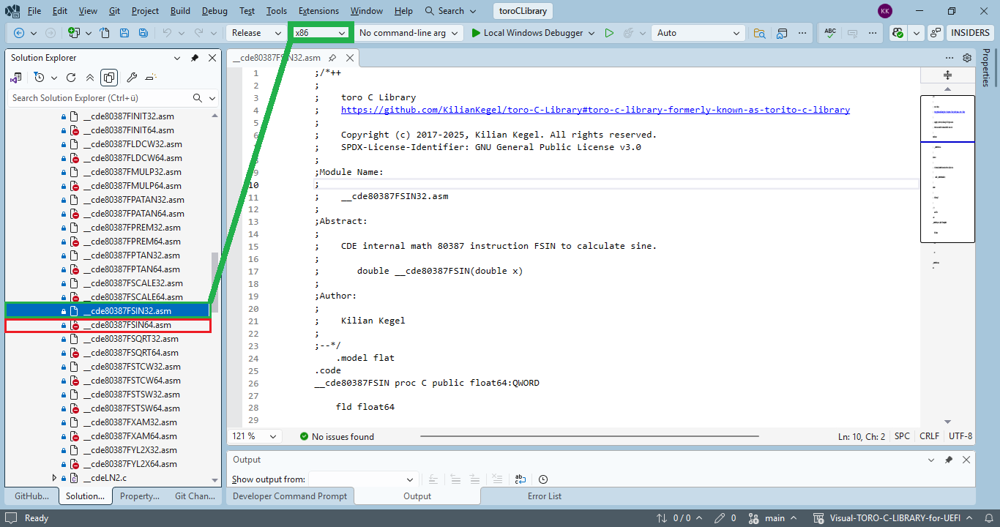

[](https://math.berkeley.edu/news/congratulations-professor-william-velvel-kahan)
***"Credit must be given to those people who played key roles in the development of the 8087.<br>
The 8087 would not have been possible without the clear insight and strong guidance offerred by*** **Prof. W. Kahan** ***at UC Berkeley.<br>
We did not do as well as he wanted, but we did better than he expected."***
<sup>[[0]](https://github.com/KilianKegel/4KPages-8087PRIMER/blob/main/images/COVERfront.jpeg)</sup>
<sup>[[1]](https://github.com/KilianKegel/4KPages-8087PRIMER/blob/main/images/THE8087PRIMER_005.jpg)</sup>
<sup>[[2]](https://github.com/KilianKegel/4KPages-8087PRIMER/blob/main/images/THE8087PRIMER_006.jpg)</sup>


[](https://upload.wikimedia.org/wikipedia/commons/a/aa/Intel_8087_die.JPG)<br><br>

# Engineering the UEFI C Library
### CdePkgBlog 2025-09-15

# ***Part 1: math.h***


### Table of content
* [Preface](README.md#Preface)
* [Abstract](README.md#Abstract)
* [Introduction](README.md#Introduction)
    * [Retrospective](README.md#Retrospective)
* [Library requirements](README.md#Library-requirements)
* [Hardware conditions](README.md#Hardware-conditions)
* [Software conditions](README.md#Sofware-conditions)
    * [Floating point models: `precise`, `fast`, `strict`](README.md#floating-point-models-precise-fast-strict)
    * [Passing floating‑point parameters and returning results](README.md#passing-floatingpoint-parameters-and-returning-results)
    * [8087 FPU LOAD/STORE instructions](README.md#8087-fpu-loadstore-instructions)
    * [The Precision Tradeoff](README.md#the-precision-tradeoff)
    * [Demonstrating `sin()`](README.md#demonstrating-sin)
* [Configure Visual Studio](README.md#configure-visual-studio)
* [Validation: toroCVS — toro C Library Validation Suite](README.md#validation-torocvs--toro-c-library-validation-suite)
    * [Basic concept](README.md#basic-concept)
    * [Example: sin() validation](README.md#example-sin-validation)
* [Testresults: math.h](README.md#testresults-mathh)

# Preface
Developing accurate mathematical floating‑point functions is a challenge that usually
requires advanced mathematical expertise.<br>

Using the mathematical coprocessor (floating point unit, FPU) **Intel 8087** simplifies the task to an engineering level.<br>

Even today, the **Intel 8087** is the most precise computing unit in x86 processors.<br>

This work (software implementation of **Standard C Library math.h** functions) is dedicated to the people who created the **Intel 8087** and the **IEEE 754 Standard**, first of all:<br>
* **Prof. William Kahan**<br>
furthermore
* **Jerome Coonen**
* **Prof. Harold Stone**
* **John Palmer** (Intel)
* **Stephen P. Morse** (Intel)
* **Rafi Nave** (Intel)

Without the **Intel 8087**, this task could not have been accomplished.<br>


# Abstract
The **UEFI C Library**  discussed here is the [**toro C Library**](https://github.com/KilianKegel/toro-C-Library), [source code](https://github.com/KilianKegel/Visual-TORO-C-LIBRARY-for-UEFI). 

**toro C Library** is a *monolithic* Standard C Library for the UEFI x86-64 
target platform.

The **toro C Library** is implemented to target [**ANSI/ISO C Standard Library**]( https://www.open-std.org/jtc1/sc22/wg14/www/docs/n1256.pdf#page=176) compatibility,
enabling the creation of applications and drivers for UEFI systems using the design and debugging 
infrastructure provided by current **Microsoft C tool chain** in **Visual Studio 2022**.

To implement the [**math.h** functions](https://www.open-std.org/JTC1/SC22/WG14/www/docs/n1256.pdf#page=224) the **80387** **FPU** is used.<br>
That allows compact and precise implementation also for **POST** (power on self test) usage.

This article introduces a high precision, high performance and low code size [**`math.h`**](https://www.open-std.org/JTC1/SC22/WG14/www/docs/n1256.pdf#page=224) implementation for UEFI drivers, UEFI shell applications and Windows applications on x86-64 platforms.
It discusses the  design decisions, tradeoffs and  describes the validation concept.
Additionally a short retrospective of floating point calculation is given.

# Introduction
The **FPU** is the foundation of this math library, providing a space-optimized, 
ROM-able implementation of C's MATH.H functions while maintaining the precision and correctness 
already established in earlier x87-based math libraries.<br>

Since the traditional **FPU** **80387** is still present in current x86 processors and is 
also ***not deprecated*** in the [**X86S specification**](https://www.intel.com/content/www/us/en/developer/articles/technical/envisioning-future-simplified-architecture.html), [**.PDF**](https://github.com/KilianKegel/4KPages-TechDocs/blob/main/x86s-eas-external-1.1.pdf),
it can be safely used here, now and in the future on x86-based platforms.<br>

The **80387** processor has various improvements over its **8087** predecessor, such as<br>
  * range extension for transcendental function:

    | Instruction  | function                      |
    |--------------|-------------------------------|
    |FPTAN         | Partial tangent               |
    |FPATAN        | Partial arctangent            |
    |F2XM1         | 2<sup>x</sup> - 1             |
    |FYL2X         | Y * log<sub>2</sub>X          |
    |FYL2XP1       | Y * log<sub>2</sub>(X + 1)    |
    
* new instructions, e.g.

    | Instruction  | function                      |
    |--------------|-------------------------------|
    |FSIN          | sine                          |
    |FCOS          | cosine                        |

This **FPU** is still today the most precise arithmetic unit in the x86 processor — because it uses 80-bit floating point arithmetic internally.<br>
Additionally it provides on current x86-64 processors a complete set of transcendental functions: **logarithm**, **exponential function**, **sine**, **cosine**, **tangent** and the corresponding inverse (arc) functions.<br>

Instead the modern [**SSE instruction set**](https://en.wikipedia.org/wiki/Streaming_SIMD_Extensions) uses only 64-bit double precision floating point arithmetic
and is not spread internally to higher bit width.<br>
**SSE** is designed for vector processing of arithmetic operations on multiple data sets in parallel.<br>
Calculation of transcendental functions is not supported directly by the **SSE** instruction set.<br>

### Retrospective
Until the 1970s a floating‑point standard did not exist. Manufacturers of computing systems 
and programming languages implemented different floating‑point representations and arithmetic.
This made it difficult to port software between different systems and to compare the results of floating‑point calculations:<br>
[YOUTUBE: William Kahan on the 8087 and designing Intel's floating point](https://www.youtube.com/watch?v=L-QVgbdt_qg)

The company [**Intel**](https://en.wikipedia.org/wiki/Intel), founded in 1968, decided to provide a floating‑point coprocessor (**FPU**) for its new 16‑bit microprocessors,
and to end the chaos of incompatible floating‑point implementations.

The upcoming [**8087**](https://en.wikipedia.org/wiki/X87#8087) was designed to provide the **entire floating‑point library** on a single chip:
* Floating‑point algebraic functions: **addition, subtraction, multiplication, division, and square root**
* Floating‑point transcendental functions: **logarithm, exponential, tangent, arctangent** <br>
  NOTE: Sine and cosine functions became directly available with the **80387**.  
  Before that, these functions were derived from tangent and arctangent.
* Floating‑point constants: **0.0, 1.0, log<sub>2</sub>(e), log<sub>2</sub>(10), log<sub>10</sub>(2), log<sub>e</sub>(2), π**
* **64‑bit** integer and packed BCD arithmetic

At that time the semiconductor technology at **Intel** was able to produce chips with approximately 40,000 transistors.<br>
The limitation required a very *efficient design* of the **FPU** interface and architecture,
which was challenging for programmers and compiler writers:<br>
* [**On the Advantages of the 8087’s Stack**](documents/87STACK.pdf)
* [**How Intel 80x87 Stack Over/Underflow Should Have Been Handled**](documents/STACK87.pdf)

NOTE: Competing FPU designs, such as the [**Motorola 68881**](https://en.wikipedia.org/wiki/Motorola_68881), 
entered the market later, as process technology enabled approximately 160,000 transistors, offering an easier‑to‑use architecture and interface.

### The Intel 8087, the Intel 80387 and the IEEE 754 Standard
The Intel 8087, introduced in 1980, was the first **FPU** designed to work with the 
Intel **8086** and **8088** microprocessors. 

While the **8087** was not fully compliant with the later [**IEEE 754 standard**](https://en.wikipedia.org/wiki/IEEE_754),
it laid the groundwork for future floating‑point units. 

In 1985, Intel released the **80387**, which was designed to be fully compliant 
with the [**IEEE 754 standard**](https://en.wikipedia.org/wiki/IEEE_754), which was finalized in the same year.<br>

# Library requirements
The UEFI C Library ([**toro C Library**](https://github.com/KilianKegel/toro-C-Library)) runs on x86-64 platforms
during **POST** in **PEI-**, **DXE-**, **SMM-drivers**, in **UEFI Shell apps** and in **Windows 64/32 console apps**.<br>

The **ANSI C (C90)** **`math.h`** function set requires 22 functions:<br>
**`acos()`**, **`asin()`**, **`atan()`**, **`atan2()`**, **`ceil()`**, **`cos()`**,<br>
**`cosh()`**, **`exp()`**, **`fabs()`**, **`floor()`**, **`fmod()`**, **`frexp()`**, <br>
**`ldexp()`**, **`log()`**, **`log10()`**, **`modf()`**, **`pow()`**, **`sin()`**, <br>
**`sinh()`**, **`sqrt()`**, **`tan()`**, **`tanh()`**<br>

# Hardware/Software conditions — 

## Hardware conditions
All UEFI-enabled x86-64 platforms provide the **80387** **FPU** and
the **SSE2** instruction set as a minimum.<br>

Access to the **80387** and the **SSE** arithmetic unit is possible in all CPU modes and privilege levels.<br>

## Software conditions
The entire design and development of the [**toro C Library**](https://github.com/KilianKegel/toro-C-Library)
is done using the latest [**Visual Studio**](https://visualstudio.microsoft.com/vs/) [standard installation for C/C++](https://github.com/KilianKegel/Howto-setup-a-UEFI-Development-PC?tab=readme-ov-file#install-visual-studio-2022).<br>
**Visual Studio** provides a complete and robust C/C++ development environment that offers excellent build performance and debugging features.<br>
**Visual Studio** enables developers to achieve their goals quickly.<br>

### Floating point models: `precise`, `fast`, `strict`
The Microsoft C/C++ compiler offers 3 different **floating point models** in both the 32- and 64-bit code generator:<br>
* **precise**
* **fast**
* **strict**

To illustrate the differences between these models, a small test program simply calls the sine function **`sin()`**:<br>
```c
#include <stdlib.h>
#include <math.h>

void main(int argc) 
{
    volatile double d = sin(argc);
}
```
#### 32Bit  machine code model `precise`:
```asm
_main:
  00000000: 55                 push        ebp
  00000001: 8B EC              mov         ebp,esp
  00000003: 83 EC 08           sub         esp,8
  00000006: 66 0F 6E 45 08     movd        xmm0,dword ptr [ebp+8]       ; load integer parameter argc into xmm0
  0000000B: F3 0F E6 C0        cvtdq2pd    xmm0,xmm0                    ; CVTDQ2PD — Convert Packed Doubleword Integers to Packed 
                                                                        ;            Double Precision Floating-Point Values
  0000000F: E8 00 00 00 00     call        __libm_sse2_sin_precise      ; invoke sin() with parameter in xmm0
                                                                        ; NOTE: __libm_sse2_sin_precise is the function name generated
                                                                        ; by the Microsoft C/C++ compiler in PRECISE mode
  00000014: F2 0F 11 45 F8     movsd       mmword ptr [ebp-8],xmm0      ; result is returned in xmm0 and stored in the local variable d
  00000019: 33 C0              xor         eax,eax                      ; return code 0 in eax
  0000001B: 8B E5              mov         esp,ebp
  0000001D: 5D                 pop         ebp
  0000001E: C3                 ret
```
#### 32Bit  machine code model `strict`:
```asm
_main:
  00000000: 55                 push        ebp
  00000001: 8B EC              mov         ebp,esp
  00000003: 83 EC 08           sub         esp,8
  00000006: 66 0F 6E 45 08     movd        xmm0,dword ptr [ebp+8]       ; load integer parameter argc into xmm0
  0000000B: 83 EC 08           sub         esp,8
  0000000B: F3 0F E6 C0        cvtdq2pd    xmm0,xmm0                    ; CVTDQ2PD — Convert Packed Doubleword Integers to Packed 
                                                                        ;            Double Precision Floating-Point Values
  00000012: F2 0F 11 04 24     movsd       mmword ptr [esp],xmm0        ; store parameter on stack
  00000017: E8 00 00 00 00     call        _sin                         ; invoke sin() with parameter on stack
                                                                        ; NOTE: _sin is the function name generated in STRICT mode
  0000001C: 83 C4 08           add         esp,8
  0000001F: 33 C0              xor         eax,eax                      ; return code 0 in eax
  00000021: DD 5D F8           fstp        qword ptr [ebp-8]            ; result is returned in ST(0) and stored in the local variable d
  00000024: 8B E5              mov         esp,ebp
  00000026: 5D                 pop         ebp
  00000027: C3                 ret
```

#### 32Bit  machine code model `fast`:
```asm
_main:
  00000000: 55                 push        ebp
  00000001: 8B EC              mov         ebp,esp
  00000003: 83 EC 08           sub         esp,8
  00000006: 66 0F 6E 45 08     movd        xmm0,dword ptr [ebp+8]       ; load integer parameter argc into xmm0
  0000000B: F3 0F E6 C0        cvtdq2pd    xmm0,xmm0                    ; CVTDQ2PD — Convert Packed Doubleword Integers to Packed
                                                                        ;            Double Precision Floating-Point Values
  0000000F: E8 00 00 00 00     call        ___libm_sse2_sin             ; invoke sin() with parameter in xmm0
                                                                        ; NOTE: ___libm_sse2_sin is the function name generated
                                                                        ; by the Microsoft C/C++ compiler in FAST mode
  00000014: F2 0F 11 45 F8     movsd       mmword ptr [ebp-8],xmm0      ; result is returned in xmm0 and stored in the local variable d
  00000019: 33 C0              xor         eax,eax                      ; return code 0 in eax
  0000001B: 8B E5              mov         esp,ebp
  0000001D: 5D                 pop         ebp
  0000001E: C3                 ret
```

#### 64Bit  machine code model `precise`, `strict` and `fast`:
NOTE: In 64Bit mode **`precise`**, **`strict`** and **`fast`** model the parameter is passed in the **XMM0** register and the result is returned in the **XMM0** register.<br>
```asm
main:
  00000000: 48 83 EC 28        sub         rsp,28h
  00000004: 66 0F 6E C1        movd        xmm0,ecx                     ; load integer parameter argc into xmm0
  00000008: f3 0f e6 c0        cvtdq2pd    xmm0,xmm0                    ; CVTDQ2PD — Convert Packed Doubleword Integers to Packed
                                                                        ;            Double Precision Floating-Point Values
  0000000C: E8 00 00 00 00     call        sin                          ; invoke sin() with parameter in xmm0
  00000011: F2 0F 11 44 24 38  movsd       mmword ptr [rsp+38h],xmm0    ; result is returned in xmm0 and stored in the local variable d
  00000017: 33 C0              xor         eax,eax                      ; return code 0 in eax
  00000019: 48 83 C4 28        add         rsp,28h
  0000001D: C3                 ret
```

To allow portability to other compilers too the true function name should be generated and not some compiler-specific alias.<br>
It turned out that the **`strict`** model is the best choice for the **toro C Library**, because it generates the true function name
in 64Bit and 32Bit mode.

### Passing floating‑point parameters and returning results
**8087** instructions required to implement **ANSI-C** **math.h** functions return a **double** value and take one or two **double** arguments.<br>

In 32Bit code the parameters are pushed from right to left onto the stack and the result is returned in the **ST(0)** register.<br>
In 64Bit code the first parameter is passed in **XMM0**, the second in **XMM1** and the result is returned in the **XMM0** register.<br>


### 8087 FPU LOAD/STORE instructions 
The 8087 I/O interface is based on a set of [**LOAD**](https://www.felixcloutier.com/x86/fst:fstp) and [**STORE**](https://www.felixcloutier.com/x86/fst:fstp)
instructions to transfer data between memory and the FPU register stack.<br>
There is no direct FPU-register-to-CPU-register transfer instruction.<br>

That means when parameters/results are passed/returned via XMM registers, the data must be transferred between XMM and FPU registers via memory.<br>

### The Precision Tradeoff
To simplify  program flow and use of built-in floating point compiler capabilities,
pre- and postprocessing of **8087** **FPU** parameters/results are done in high-level language.<br>

To implement **math.h** functions to run entirely inside **8087** (internally in 80Bit precision) would allow
higher precision and faster processing, but would require much more time to implement and validate.<br>
Therefore this approach was rejected and a mixed **8087 FPU**/**SSE unit** 64Bit implementation was chosen.<br>

### Demonstrating `sin()`
The implemented sine  **`sin()`** function is here:<br>
```c
[00]    double __cdecl sin(double x)
[01]    {
[02]        CDEDOUBLE d = { .dbl = x };
[03]        CDEDOUBLE dRet = { .uint64 = 0x7FF8042000000000LL };
[04]        
[05]        do 
[06]        {
[07]    
[08]            if (d.member.exp == 0x7FF)                                  // check for NaN or INF
[09]            {
[10]                dRet.uint64 = 0x0008000000000000ULL | d.uint64;
[11]    
[12]                if (0ULL == d.member.mant)
[13]                    dRet.uint64 = 0x8008000000000000ULL | d.uint64,
[14]                    errno = EDOM;                                       // set errno to EDOM for sin(NaN)=NaN and sin(INF)=NaN
[15]    
[16]                break;
[17]            }
[18]    
[19]            if ((63 + 1023) > d.member.exp)
[20]                dRet.dbl = __cde80387FSIN(x);                           // invoke 80387 FSIN instruction 
[21]            else
[22]                errno = ERANGE;                                         // set errno to ERANGE for |x| > 2^63
[23]    
[24]        } while (0);
[25]    
[26]        return dRet.dbl;
[27]    }
```
After testing parameters for number range and validity (NaN, INF) the actual sine calculation is done in line [20] by invoking the wrapper function 
32Bit [**`__cde80387FSIN()`**](https://github.com/KilianKegel/Visual-TORO-C-LIBRARY-for-UEFI/blob/main/toroCLibrary/Library/math_h/__cde80387FSIN32.asm)/ 64Bit [**`__cde80387FSIN()`**](https://github.com/KilianKegel/Visual-TORO-C-LIBRARY-for-UEFI/blob/main/toroCLibrary/Library/math_h/__cde80387FSIN64.asm):<br>

#### Assembler code for 32Bit interface:
```asm
[00]    __cde80387FSIN proc C public float64:QWORD
[01]    
[02]        fld float64                                                     ; load parameter x from stack into ST(0)
[03]    
[04]        FSIN                                                            ; calculate sine of ST(0), result is returned in ST(0)
[05]    
[06]        ret                                                             ; result is returned in ST(0)
[07]    
[08]    __cde80387FSIN endp
```
#### Assembler code for 64Bit interface:
```asm
[00]    __cde80387FSIN proc
[01]    
[02]        local float64:QWORD
[03]    
[04]        movsd float64,xmm0                                              ; move parameter x from xmm0 into memory
[05]    
[06]        fld float64                                                     ; load parameter x from memory into ST(0)
[07]    
[08]        FSIN                                                            ; calculate sine of ST(0), result is returned in ST(0)
[09]    
[10]        fstp float64                                                    ; store result from ST(0) into memory
[11]    
[12]        movsd xmm0,float64                                              ; move result from memory into xmm0
[13]    
[14]        ret
[15]    
[16]    __cde80387FSIN endp
```
## Configure Visual Studio
With the above insights the Visual Studio project can be configured to implement all required library functions.<br>


All wrapper functions are written in assembly language and must be implemented in both 32Bit and 64Bit mode:<br>

|32Bit|64Bit|
|-|-|
|[**`__cde80387FSIN()`**](https://github.com/KilianKegel/Visual-TORO-C-LIBRARY-for-UEFI/blob/main/toroCLibrary/Library/math_h/__cde80387FSIN32.asm)|[**`__cde80387FSIN()`**](https://github.com/KilianKegel/Visual-TORO-C-LIBRARY-for-UEFI/blob/main/toroCLibrary/Library/math_h/__cde80387FSIN64.asm)|
|[**`__cde80387FCOS()`**](https://github.com/KilianKegel/Visual-TORO-C-LIBRARY-for-UEFI/blob/main/toroCLibrary/Library/math_h/__cde80387FCOS32.asm)|[**`__cde80387FCOS()`**](https://github.com/KilianKegel/Visual-TORO-C-LIBRARY-for-UEFI/blob/main/toroCLibrary/Library/math_h/__cde80387FCOS64.asm)|
|[**`__cde80387FPTAN()`**](https://github.com/KilianKegel/Visual-TORO-C-LIBRARY-for-UEFI/blob/main/toroCLibrary/Library/math_h/__cde80387FPTAN32.asm)|[**`__cde80387FPTAN()`**](https://github.com/KilianKegel/Visual-TORO-C-LIBRARY-for-UEFI/blob/main/toroCLibrary/Library/math_h/__cde80387FPTAN64.asm)|
|[**`__cde80387FPATAN()`**](https://github.com/KilianKegel/Visual-TORO-C-LIBRARY-for-UEFI/blob/main/toroCLibrary/Library/math_h/__cde80387FPATAN32.asm)|[**`__cde80387FPATAN()`**](https://github.com/KilianKegel/Visual-TORO-C-LIBRARY-for-UEFI/blob/main/toroCLibrary/Library/math_h/__cde80387FPATAN64.asm)|
|[**`__cde80387FSQRT()`**](https://github.com/KilianKegel/Visual-TORO-C-LIBRARY-for-UEFI/blob/main/toroCLibrary/Library/math_h/__cde80387FSQRT32.asm)|[**`__cde80387FSQRT()`**](https://github.com/KilianKegel/Visual-TORO-C-LIBRARY-for-UEFI/blob/main/toroCLibrary/Library/math_h/__cde80387FSQRT64.asm)|
|[**`__cde80387FSCALE()`**](https://github.com/KilianKegel/Visual-TORO-C-LIBRARY-for-UEFI/blob/main/toroCLibrary/Library/math_h/__cde80387FSCALE32.asm)|[**`__cde80387FSCALE()`**](https://github.com/KilianKegel/Visual-TORO-C-LIBRARY-for-UEFI/blob/main/toroCLibrary/Library/math_h/__cde80387FSCALE64.asm)|
|[**`__cde80387FYL2X()`**](https://github.com/KilianKegel/Visual-TORO-C-LIBRARY-for-UEFI/blob/main/toroCLibrary/Library/math_h/__cde80387FYL2X32.asm)|[**`__cde80387FYL2X()`**](https://github.com/KilianKegel/Visual-TORO-C-LIBRARY-for-UEFI/blob/main/toroCLibrary/Library/math_h/__cde80387FYL2X64.asm)|
|[**`__cde80387F2XM1()`**](https://github.com/KilianKegel/Visual-TORO-C-LIBRARY-for-UEFI/blob/main/toroCLibrary/Library/math_h/__cde80387F2XM132.asm)|[**`__cde80387F2XM1()`**](https://github.com/KilianKegel/Visual-TORO-C-LIBRARY-for-UEFI/blob/main/toroCLibrary/Library/math_h/__cde80387F2XM164.asm)|

Each function must be added to the project and configured to build for both 32Bit and 64Bit mode in the Property Page:<br>


So that each file is employed in build in its respective mode:<br>
#### 32Bit mode:

#### 64Bit mode:


# Validation: toroCVS — toro C Library Validation Suite
**toroCVS** is a proprietary test suite to validate the **toro C Library**.<br>


### Basic concept 
**toro C Library** is validated against the original **Microsoft C Library** in **Visual Studio 2022** — **Microsoft C Library** is the reference implementation.<br>
**toro C Library** is actually a submodule of the **toroCVS** superproject. Each **toro C Library** function has a
corresponding test module in **toroCVS**.<br>
Because processing speed and storage capacity of current PCs are high, the test suite usually simply uses a kind of brute‑force strategy for validation.<br>

The test suite generates the required test parameters, invokes the **DUT** (*device under test* – math.h function) with these parameters and
reports the results in a .LOG file in the build folder.<br>

The test is executed on both:<br>
* **toro C Library**‑linked test application
* **Microsoft C Runtime Library**‑linked test application


Each .LOG file is inspected carefully to identify bugs/miscalculations.<br>
For **math.h** functions this is a challenging task, because the results of floating‑point calculations
may differ in the lower significant bits but are correct anyway.<br>
It is really hard to identify true miscalculations among millions of trace lines, with about one million non‑relevant differences.<br>

These natural differences arise because the respective libraries use different arithmetic units: the **8087 FPU** vs. the **SSE unit**.
For example, for the **`pow()`** function:

### Example: `sin()` validation
The test module core for the **`sin()`** function is given below:<br>
```c
    .
    .
    .
for (uint64_t s = 0; s <= 1; s++)                                                       // sign +,-
{
    d.member.sign = s;
    for (size_t E = 0; E <= 0x43F; E++)                                                 // exponent 0..1087
    {
        d.member.exp = E;
        for (add = 1, sftM = 0, mant = (1ULL << sftM); sftM < 52; sftM += add++)        // bit shifted through mantissa
        {

            if (add == 10)
                add = 6;
            mant = (1ULL << sftM);
            //
            // fill mantpat with all possible mantissa patterns below
            //
            num = -1;
            mantpat[++num] = mant - 1;                              // 2->1, 4->3, 8->7, 16->0xF, 32->0x1F, 
                                                                    //  64->0x3F, 128->0x7F, 256->0xFF, 512->0x1FF
            mantpat[++num] = mant;                                  // 2->2, 4->4, 8->8, 16->16, 32->32, 64->64, 128->128, 256->256, 512->512                    
            mantpat[++num] = (mant - 1) & 0x0005555555555555ULL;    // pattern 010101...
            mantpat[++num] = (mant - 1) & 0x000AAAAAAAAAAAAAULL;    // pattern 101010...
            mantpat[++num] = ~(mant - 1);                           // 2->0xFFFFFFFFFFFFFFFE, 4->0xFFFFFFFFFFFFFFFC, 8->0xFFFFFFFFFFFFFFF8
            mantpat[++num] = ~(mant - 1) & 0x0005555555555555ULL;   // pattern 101010...
            mantpat[++num] = ~(mant - 1) & 0x000AAAAAAAAAAAAAULL;   // pattern 010101...
            mantpat[++num] = ~mant;                                 // 2->0xFFFFFFFFFFFFFFFD, 4->0xFFFFFFFFFFFFFFFB, 8->0xFFFFFFFFFFFFFFF7
            mantpat[++num] = ~mant & 0x0005555555555555ULL;         // pattern 101010...
            mantpat[++num] = ~mant & 0x000AAAAAAAAAAAAAULL;         // pattern 010101...
            if (51 == sftM)                                         // last run, fill up with some more patterns
                mantpat[++num] = mant;


            for (int i = 0; i <= num; i++)                          // loop for all patterns
            {
                d.member.mant = mantpat[i];                         // set mantissa pattern

                errno = 0;                                          // clear errno before call

                r.dbl = sin(d.dbl);                                 // call DUT()
                overallsamples++;
                if (0 != iFullLog || r.uint64 != o.uint64)
                    printf("%6d: sin(0x%016llX) -> 0x%016llX errno %d\n", ++line, d.uint64, r.uint64, errno),
                        loggedsamples++;
                o = r;
            }
        }
    }
}
    .
    .
    .
```

# Test results: ***math.h***
The test results of all **math.h** functions can be found here:<br>
(to keep diff file size small, only 15 lines around differences are shown)<br>
* [**acos()**](https://cdn.githubraw.com/KilianKegel/toroCVSreport/main/report/math_h/x64/acos.html)<br>
* [**asin()**](https://cdn.githubraw.com/KilianKegel/toroCVSreport/main/report/math_h/x64/asin.html)<br>
* [**atan()**](https://cdn.githubraw.com/KilianKegel/toroCVSreport/main/report/math_h/x64/atan.html)<br>
* [**atan2()**](https://cdn.githubraw.com/KilianKegel/toroCVSreport/main/report/math_h/x64/atan2.html)<br>
* [**ceil()**](https://cdn.githubraw.com/KilianKegel/toroCVSreport/main/report/math_h/x64/ceil.html)<br>
* [**cos()**](https://cdn.githubraw.com/KilianKegel/toroCVSreport/main/report/math_h/x64/cos.html)<br>
* [**cosh()**](https://cdn.githubraw.com/KilianKegel/toroCVSreport/main/report/math_h/x64/cosh.html)<br>
* [**exp()**](https://cdn.githubraw.com/KilianKegel/toroCVSreport/main/report/math_h/x64/exp.html)<br>
* [**fabs()**](https://cdn.githubraw.com/KilianKegel/toroCVSreport/main/report/math_h/x64/fabs.html)<br>
* [**floor()**](https://cdn.githubraw.com/KilianKegel/toroCVSreport/main/report/math_h/x64/floor.html)<br>
* [**fmod()**](https://cdn.githubraw.com/KilianKegel/toroCVSreport/main/report/math_h/x64/fmod.html)<br>
* [**frexp()**](https://cdn.githubraw.com/KilianKegel/toroCVSreport/main/report/math_h/x64/frexp.html)<br>
* [**ldexp()**](https://cdn.githubraw.com/KilianKegel/toroCVSreport/main/report/math_h/x64/ldexp.html)<br>
* [**log()**](https://cdn.githubraw.com/KilianKegel/toroCVSreport/main/report/math_h/x64/log.html)<br>
* [**log10()**](https://cdn.githubraw.com/KilianKegel/toroCVSreport/main/report/math_h/x64/log10.html)<br>
* [**modf()**](https://cdn.githubraw.com/KilianKegel/toroCVSreport/main/report/math_h/x64/modf.html)<br>
* [**pow()**](https://cdn.githubraw.com/KilianKegel/toroCVSreport/main/report/math_h/x64/pow.html)<br>
* [**sin()**](https://cdn.githubraw.com/KilianKegel/toroCVSreport/main/report/math_h/x64/sin.html)<br>
* [**sinh()**](https://cdn.githubraw.com/KilianKegel/toroCVSreport/main/report/math_h/x64/sinh.html)<br>
* [**sqrt()**](https://cdn.githubraw.com/KilianKegel/toroCVSreport/main/report/math_h/x64/sqrt.html)<br>
* [**tan()**](https://cdn.githubraw.com/KilianKegel/toroCVSreport/main/report/math_h/x64/tan.html)<br>
* [**tanh()**](https://cdn.githubraw.com/KilianKegel/toroCVSreport/main/report/math_h/x64/tanh.html)<br>

### Summary


